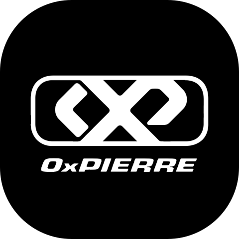

<div align="center">



# 0xPierre

**Creative Developer**<br>
Immersive web, 3D, live formats and robotics, for creators, artists and brands.

[0xpierre.com](https://0xpierre.com) · [contact@0xpierre.com](mailto:contact@0xpierre.com)

</div>

```
> identity: 0xPierre
> role: Creative Developer
> core: React · Next.js · TypeScript
> also: Three.js · Unreal Engine · Robotics
```

## What I do

- **Immersive web and 3D.** Websites and apps that feel like experiences: React, Next.js, Three.js.
- **Live and interactive formats.** Web games and tools built for streams, shows and events.
- **Games and real-time 3D.** Unreal Engine 5, Game Boy experiences, game servers.

10+ years, 60+ projects shipped end to end. Fully remote, in French and English, as a freelancer or embedded in a team. 
Most client code is private: the projects, with videos, are on [0xpierre.com](https://0xpierre.com/#work).

## Stack

- **Web and mobile:** React, Next.js, TypeScript, React Native, Expo, Tailwind CSS, Three.js / R3F, GSAP, Framer Motion, Electron
- **Backend and infra:** Node.js, Bun, PostgreSQL, MongoDB, Redis, Drizzle, Prisma, Docker, Linux
- **Game and 3D:** Unreal Engine, Unity, C++, Lua, Blender, CS2, Garry's Mod, S&box
- **Robotics:** ROS / ROS 2, Unitree SDK, Python, MuJoCo, Isaac Lab, motion control, Raspberry Pi
- **Web3:** Zcash, Solidity, EVM, Solana, Rust, IPFS

## Elsewhere

[](https://x.com/0xPierre_com)
[](https://www.instagram.com/0xpierre.dev)
[](https://www.twitch.tv/0xpierre_)
[](https://www.youtube.com/c/0xPierre)
